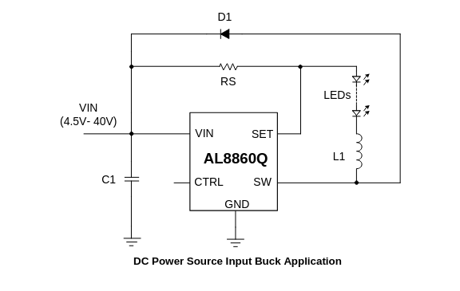

# designing the current sense path
the INA180A4 has 200:1 gain. this puts a 300mA current across the 0.05Ohm shunt at 3.3V, close to STM32 max logic level. this is good enough, we can divide it down later if we want to push more current i.e. with pwm.  
the al8860Q is a feedback controller with an inductor and sensing resistors. we need to set 333mA with a 0.3ohm resistor btwn VIN and SET pins as described in datasheet:  

we will also need an inductor to support this driver and a 4.7-10uF cap as close as possible to the input. also needs a "fast low-capacitance shottky diode with low reverse leakage current."  
inductor selection: 33uH to 100uH, proportional to supply voltage. "as close to IC as possible with low resistance interconnect"  
i think there should be short circuit current monitoring for charge and discharge, but it should only need to be pack-level.  
then we monitor cell voltages and do some active balancing... or passive for ease of execution  

we use the MC34063AD to take usb in 5v to 12v for the series battery stack - this is a boost conv control IC so we need to make the boost circuit  
[digikey page](https://www.digikey.com/en/products/detail/onsemi/MC34063ADR2G/919066)

our input current has to be 1.8A, since we have Vin = 5, Vout = 12, ballpark efficiency of 0.85, and Iout = 0.65A, and Iin = (Vout x Iout)/(Vin x efficiency)  

this means we have an Isw of (Iin + Il/2), estimating Il to be 0.3 x 1.8A, Isw = (1.8+0.27) = 2.07A  

this is much higher than the Isw of the MC34063. however we can use an external FET to raise the current limit substantially. we will use our friend the jellybean AO3400A which can do like 5A easy  

MUST USE P CHANNEL FET, possible with another fet before it for the external switch for mc34063. also move the resistor on the gate
